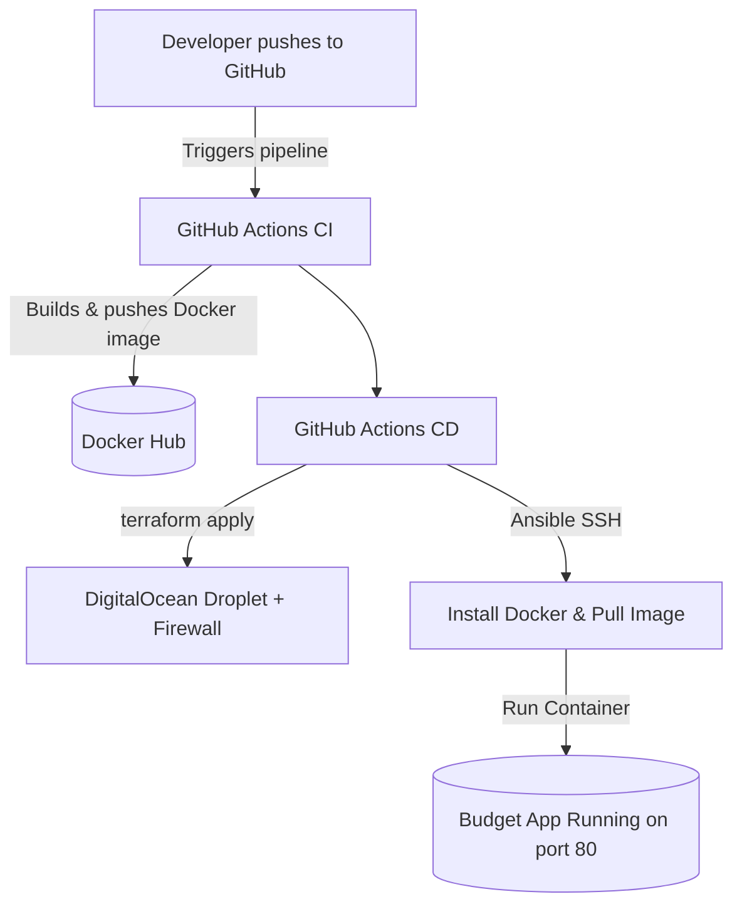

# 🌐 DevOps Portfolio Project — Automated Budget Tracker

A fully automated deployment pipeline for a budget-tracking web application, demonstrating end-to-end DevOps practices including Infrastructure as Code (IaC), CI/CD, containerization, and cloud automation.


---

## 🏅 Tech Stack & Tools

[]()
[]()
[]()
[]()
[]()
[]()

---

## 🚀 Project Overview

This project demonstrates a complete DevOps workflow by automating:

- Infrastructure provisioning with Terraform  
- Server configuration with Ansible  
- Application containerization with Docker  
- CI/CD pipelines via GitHub Actions  
- Deployment on DigitalOcean

Every push to `main` triggers:

1. Docker build & push to Docker Hub  
2. Terraform infrastructure provisioning  
3. Ansible automated configuration + app deployment  

---

## 🏗️ High-Level Architecture Workflow



📂 **Folder Structure**
```bash
├── .github/workflows/main.yml         # GitHub Actions CI/CD Pipeline Definition
├── ansible/
│   ├── playbook.yml                   # Ansible playbook for Docker install + container deployment
│   └── inventory.ini.example          # Example inventory for local Ansible runs
├── terraform/
│   ├── main.tf                        # DigitalOcean Droplet + Firewall definition (IaC)
│   ├── variables.tf                   # Terraform input variables
│   ├── outputs.tf                     # Outputs (e.g., Droplet IP address) for CI/CD
│   └── provider.tf                    # Cloud provider configuration (DigitalOcean)
├── app/
│   ├── Dockerfile                     # Instructions for building the application image
│   ├── requirements.txt               # Application dependencies
│   └── src/                           # Application source code (e.g., Python/Flask or Node.js)
├── screenshot.png                     # Visual confirmation of the running application
└── README.md                          # Project documentation
```

⚙️ **CI/CD Details**

✅ **CI — build_and_push**


Checkout repository

Login to Docker Hub using GitHub secrets

Build & tag Docker image

Push image to Docker Hub

✅ **CD — deploy**


Terraform init + apply to provision/update Droplet & Firewall

Retrieve Droplet IP from Terraform output

SSH to Droplet using GitHub Secret key

Install Docker, pull the latest image, and run container

🔐 **Required GitHub Secrets**


| Secret            | Purpose                              |
| ----------------- | ------------------------------------ |
| `DO_TOKEN`        | DigitalOcean API token for Terraform |
| `DOCKER_USERNAME` | Docker Hub login                     |
| `DOCKER_PASSWORD` | Docker Hub token/password            |
| `SSH_PRIVATE_KEY` | Private SSH key for Ansible          |


**💻 Local Usage**

💻 **Local Run and Testing**


To locally test the IaC and CM, follow these steps:

Clone the repository:
```bash

https://github.com/gheorghiostapenco/budget-tracker-tf-ansible-gha.git

cd your-repo-name

```

**Terraform**
```bash

terraform init

terraform plan -var 'ssh_key_name=YourKey'

terraform apply -var 'ssh_key_name=YourKey' -auto-approve
```

**Ansible**
```bash

ansible-playbook -i inventory.ini ansible/playbook.yml
```

**🌍 Application Access**

After deployment:

http://<Droplet_IP>


**Example API endpoint:**

http://<Droplet_IP>/api/transactions

**🎯 Skills Demonstrated**

Automated CI/CD pipelines with GitHub Actions

Terraform IaC for cloud provisioning (Droplet, Firewall)

Ansible configuration automation (SSH, Docker setup)

Docker container build & deployment

Secure secret management with GitHub Secrets

GitOps deployment workflow

DigitalOcean cloud administration


